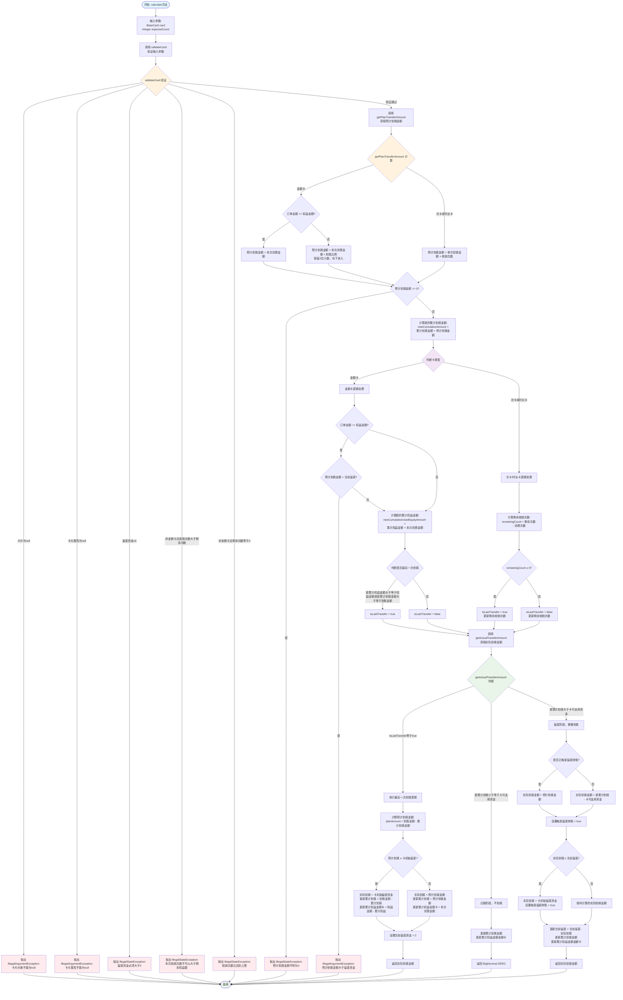

# TransferCalculate.calculate() 方法流程图

## 概述
本文档详细描述了 [`TransferCalculate.calculate()`](demo-junit/src/main/java/com/remember5/junit/card/TransferCalculate.java:27) 方法的完整逻辑流程，包括所有决策点、条件分支、循环、异常处理、输入验证、处理步骤和返回路径。

## 业务背景
该系统是一个卡片划拨计算工具，支持三种卡类型：
- **次卡 (COUNT)**: 按使用次数计算划拨
- **时长卡 (TIME)**: 按使用天数计算划拨  
- **金额卡 (AMOUNT)**: 按消费金额计算划拨

## 核心概念
- **留底资金**: 监管要求的资金保证金
- **可支用资金**: 可以直接使用的资金
- **划拨**: 从留底资金转移到可支用资金的过程
- **累计划拨**: 历史总划拨金额
- **预计划拨**: 本次计划划拨的金额

## 完整流程图



## 关键决策点说明

### 1. 输入验证 ([`validateCard`](demo-junit/src/main/java/com/remember5/junit/card/TransferCalculate.java:68))
- 检查卡片对象和关键属性是否为null
- 验证留底资金必须大于0
- 对于非金额卡，检查核销次数限制

### 2. 预计划拨金额计算 ([`getPlanTransferAmount`](demo-junit/src/main/java/com/remember5/junit/card/TransferCalculate.java:195))
- **金额卡**: 根据订单金额与权益金额关系决定计算方式
  - 相等时：预计划拨 = 本次消费金额
  - 不等时：预计划拨 = 本次消费金额 × 划拨比例
- **次卡/时长卡**: 预计划拨 = 单次划拨金额 × 核销次数

### 3. 最后一次划拨判断
- **金额卡**: 累计权益金额达到权益金额 OR 累计划拨达到到账金额
- **次卡/时长卡**: 剩余核销次数 ≤ 0

### 4. 实际划拨金额计算 ([`getActualTransferAmount`](demo-junit/src/main/java/com/remember5/junit/card/TransferCalculate.java:99))
- **最后一次划拨**: 划拨剩余所有资金
- **记账阶段**: 可支用资金充足，不需要划拨
- **留底阶段**: 可支用资金不足，需要动用留底资金

## 测试用例覆盖的关键场景

### 次卡测试场景
1. **正常核销**: 单次和批量核销
2. **边界测试**: 核销次数为0、超过剩余次数
3. **最后一次核销**: 剩余次数刚好用完

### 金额卡测试场景  
1. **订单金额等于权益金额**: 特殊验证逻辑
2. **订单金额不等于权益金额**: 按比例计算
3. **权益金额耗尽**: 累计权益达到上限
4. **大额消费**: 单次消费超过权益金额

### 异常场景
1. **参数验证**: null值、负数、零值
2. **业务规则**: 核销次数超限、留底资金不足
3. **边界条件**: 最后一次核销的特殊处理

## 流程图符号说明
- **椭圆**: 开始/结束节点
- **矩形**: 处理步骤
- **菱形**: 决策点/条件判断
- **红色**: 异常处理
- **蓝色**: 开始节点
- **绿色**: 结束节点
- **橙色**: 关键验证点
- **紫色**: 卡类型判断

## 方法调用关系
```
calculate()
├── validateCard()
├── getPlanTransferAmount()
└── getActualTransferAmount()
    ├── doLastTransfer()
    ├── notTransfer()
    │   ├── updateCumulativeAmount()
    │   └── updateCumulativeUsedEquityAmount()
    └── realTransfer()
        ├── updateCumulativeAmount()
        └── updateCumulativeUsedEquityAmount()
```

## 总结
该流程图完整展示了 [`TransferCalculate.calculate()`](demo-junit/src/main/java/com/remember5/junit/card/TransferCalculate.java:27) 方法的执行逻辑，包括：
- 完整的输入验证流程
- 三种卡类型的差异化处理逻辑
- 复杂的最后一次划拨判断
- 三种不同的划拨策略（最后一次、记账阶段、留底阶段）
- 全面的异常处理机制
- 测试用例验证的关键业务场景

该算法的核心是根据不同卡类型和当前状态，智能决定是否需要从留底资金中划拨资金到可支用账户，确保资金使用的合规性和准确性。
