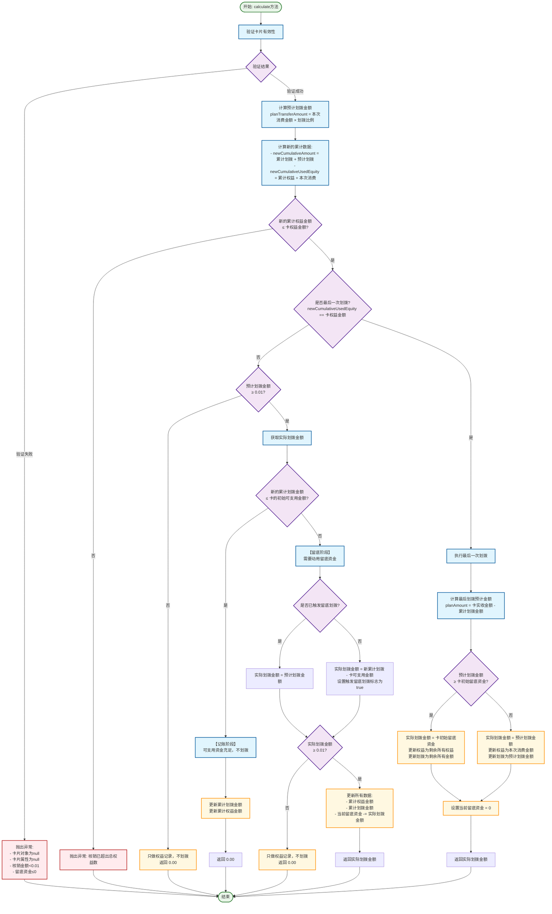

# 金额卡划拨计算算法流程图

## 算法概述

金额卡划拨计算算法用于计算每次消费时需要从留底资金划拨到可支用资金的金额。算法分为三个主要阶段：**记账阶段**、**留底阶段**和**最后一次划拨**。

## 主要流程图

## 关键决策点说明

### 1. 验证阶段
- **卡片对象验证**：确保卡片对象及关键属性不为null
- **金额验证**：核销金额必须≥0.01，留底资金必须>0
- **权益验证**：新的累计权益不能超过卡的总权益金额

### 2. 划拨模式判断
- **最后一次划拨**：当新的累计权益金额等于卡权益金额时
- **记账阶段**：新的累计划拨金额≤卡的初始可支用金额
- **留底阶段**：新的累计划拨金额>卡的初始可支用金额，需要动用留底资金

### 3. 三种处理模式

#### 记账阶段 (notTransfer)
- **条件**：可支用资金充足
- **处理**：只更新记账数据，不实际划拨资金
- **返回**：0.00

#### 留底阶段 (realTransfer) 
- **条件**：可支用资金不足，需要动用留底
- **处理逻辑**：
  - 首次触发：实际划拨 = 新累计划拨 - 卡可支用金额
  - 后续触发：实际划拨 = 预计划拨金额
- **最小金额检查**：实际划拨金额必须≥0.01
- **资金更新**：从当前留底资金中扣除实际划拨金额

#### 最后一次划拨 (doLastTransfer)
- **条件**：累计权益金额达到卡权益金额上限
- **处理逻辑**：
  - 预计划拨 ≥ 卡初始留底：划拨所有留底资金，更新所有剩余权益
  - 预计划拨 < 卡初始留底：按预计金额划拨，正常更新权益
- **最终状态**：当前留底资金设置为0

## 算法特点

1. **分阶段处理**：根据资金使用情况分为记账和留底两个阶段
2. **精确控制**：确保划拨金额不小于0.01元的最小单位
3. **权益保护**：严格控制累计权益不超过卡片权益上限
4. **资金安全**：留底资金逐步释放，确保资金安全
5. **状态追踪**：通过触发标志追踪留底划拨状态

## 测试用例分析

根据测试代码中的数据：
- **卡片配置**：权益金额10元，可支用金额9.98元，留底资金0.7元，划拨比例70%
- **正常场景**：包含单次大额消费、多次小额消费、边界金额等情况
- **异常场景**：包含超限消费、零金额消费、极小金额消费等情况

该算法通过严格的验证和分阶段处理，确保了金额卡划拨的准确性和安全性。
